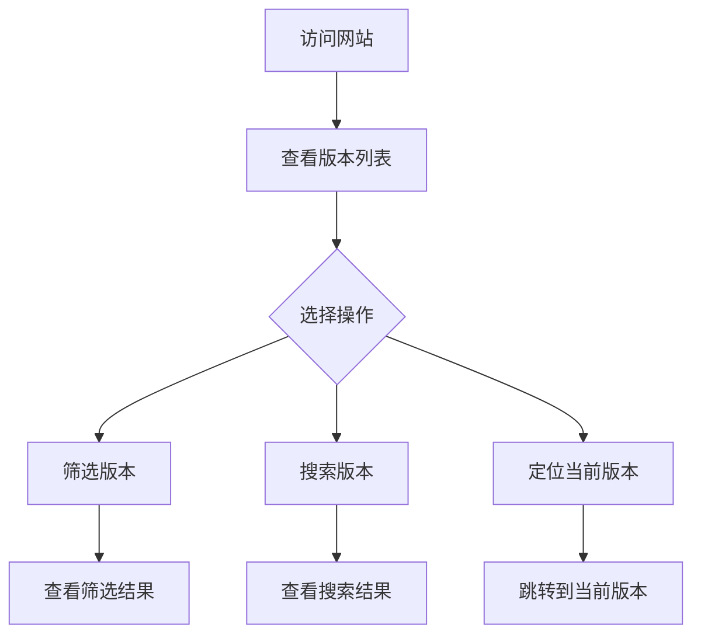

# 🚀 星穹铁道版本倒计时

🌐 **官方网站**: [box.firefly520.top](https://box.firefly520.top)  
🌐 **GitHub Pages**: [https://sakura520222.github.io/HSR-Countdown/](https://sakura520222.github.io/HSR-Countdown/)

✨ **一个现代化的星穹铁道版本倒计时应用**  
🎨 **深色科技风格设计** | ⚡ **丰富的交互功能** | 📊 **实时数据展示**

---

## 📖 项目简介

| 🎯 功能 | 📱 设备支持 | ⚡ 性能 |
|---------|------------|--------|
| 实时倒计时 | 桌面端 | 防抖搜索 |
| 智能筛选 | 平板端 | 懒加载渲染 |
| 版本管理 | 移动端 | 实时更新 |

本项目提供了一个直观的界面，展示星穹铁道从 **1.0版本** 到 **4.0预测版本** 的所有版本信息，采用现代化的深色科技风格设计。

### 🎯 核心特性

- **📊 实时数据展示** - 精确到秒的版本倒计时显示
- **🔍 智能筛选系统** - 按状态分类查看版本信息
- **🎨 现代化UI设计** - 深色科技风格，响应式布局
- **⌨️ 键盘快捷键** - 提升操作效率
- **📱 多设备支持** - 完美适配桌面、平板、手机

## ✨ 功能特性

| 类别 | 功能 | 描述 |
|------|------|------|
| 🎯 **核心功能** | 实时倒计时 | 精确到秒的版本倒计时显示 |
| 🔍 **智能筛选** | 状态分类 | 自动识别当前/历史/未来版本 |
| 📊 **数据统计** | 版本管理 | 包含1.0到4.0的完整版本数据 |
| 🎨 **交互体验** | 键盘快捷键 | ESC返回顶部、空格定位、Ctrl+F搜索 |
| 🚀 **技术特性** | 性能优化 | 防抖搜索、懒加载渲染、实时更新 |

### 🎯 核心功能

- **⏰ 实时倒计时** - 精确到秒的版本倒计时显示，每秒自动刷新
- **📋 版本管理** - 包含从 **1.0版本** 到 **4.0预测版本** 的完整数据
- **🏷️ 状态分类** - 智能识别当前版本、历史版本和未来版本

### 🔍 智能筛选系统

- **🔧 状态筛选** - 按当前版本、历史版本、未来版本分类查看
- **🔎 搜索功能** - 支持版本号关键词搜索，实时过滤结果
- **⚡ 实时过滤** - 搜索结果和筛选条件立即生效，无需刷新

### 📊 数据统计面板

- **📈 版本总数** - 显示所有版本数量统计
- **🌟 当前版本** - 突出显示当前活跃版本信息
- **⏳ 剩余天数** - 当前版本剩余时间精确统计

### 🎨 交互体验优化

- **🎯 一键定位** - 快速跳转到当前版本位置
- **⌨️ 键盘快捷键** - 支持ESC返回顶部、空格定位当前版本、Ctrl+F搜索
- **📱 响应式设计** - 完美适配桌面、平板、手机等设备
- **✨ 平滑动画** - 丰富的过渡动画和交互反馈效果

### 🚀 技术特性

- **🎨 现代化UI** - 深色科技风格设计，视觉冲击力强
- **⚡ 性能优化** - 防抖搜索、懒加载渲染，提升用户体验
- **🛡️ 错误处理** - 完善的异常捕获和用户提示机制
- **🔄 实时更新** - 每秒自动刷新倒计时，确保数据准确性
## 🛠️ 使用说明

### 🎯 基本操作流程

#### 📝 操作步骤

1. **🌐 访问网站** - 打开官方网站或GitHub Pages页面
2. **📋 查看版本列表** - 页面加载后自动显示所有版本信息
3. **🔧 筛选版本** - 点击顶部筛选按钮按状态查看版本
4. **🔎 搜索版本** - 在搜索框中输入版本号关键词
5. **🎯 定位当前版本** - 点击"定位当前版本"按钮或按空格键

### ⌨️ 键盘快捷键

| 快捷键 | 功能 | 图标 | 说明 |
|--------|------|------|------|
| `ESC` | 返回顶部 | ⬆️ | 快速回到页面顶部 |
| `空格键` | 定位当前版本 | 🎯 | 快速滚动到当前版本位置 |
| `Ctrl + F` | 聚焦搜索框 | 🔍 | 快速开始搜索版本 |

### 📱 移动端操作

- **👆 滑动浏览** - 上下滑动查看版本列表
- **👆 点击筛选** - 点击筛选按钮切换视图
- **⌨️ 搜索输入** - 使用虚拟键盘进行搜索
- **📱 触摸优化** - 所有按钮和交互都针对触摸屏优化

## 📊 版本数据

项目包含从 **1.0版本** 到 **4.0预测版本** 的完整数据，确保信息的准确性和实时性。

### 📋 数据概览

| 版本范围 | 数量 | 状态 | 时间跨度 |
|----------|------|------|----------|
| 1.x 版本 | 7个 | 已更新 | 2023-2024 |
| 2.x 版本 | 8个 | 已更新 | 2024-2025 |
| 3.x 版本 | 9个 | 进行中 | 2025-2026 |
| 4.x 版本 | 预测 | 即将发布 | 2026-2027 |

### 📅 版本详情（部分示例）

| 版本 | 开始日期 | 结束日期 | 状态 | 图标 |
|------|----------|----------|------|------|
| 1.0 | 2023-04-26 | 2023-06-07 | ✅ 已更新 | 🎯 |
| 1.1 | 2023-06-07 | 2023-07-19 | ✅ 已更新 | 🚀 |
| 1.2 | 2023-07-19 | 2023-08-30 | ✅ 已更新 | ✨ |
| ... | ... | ... | ... | ... |
| 3.0 | 2025-03-12 | 2025-04-23 | 🔄 进行中 | ⏳ |
| 4.0-预测 | 2026-03-11 | 2026-04-22 | 🔮 即将发布 | 🌟 |

> 💡 **注意**: 完整版本数据请访问网站查看，数据会实时更新

## 🎨 设计特色

### 🎨 色彩方案

| 色彩类型 | 颜色代码 | 用途 | 效果 |
|----------|----------|------|------|
| **主色调** | `#1a1a2e` | 背景 | 深蓝科技感 |
| **辅助色** | `#16213e` | 卡片 | 渐变层次 |
| **强调色** | `#0f3460` | 按钮 | 霓虹效果 |
| **高亮色** | `#e94560` | 重要信息 | 视觉焦点 |

- **🌌 主色调** - 深蓝色系，营造科技感和神秘感
- **🌈 辅助色** - 霓虹蓝、紫色渐变，增强视觉层次
- **📝 文字色** - 白色和浅灰色，确保最佳可读性
- **✨ 高亮色** - 红色系，突出重要信息和交互元素

### ✨ 视觉元素

- **🌠 背景装饰** - 动态粒子效果和星空渐变背景
- **💎 卡片设计** - 磨砂玻璃效果和柔和阴影
- **🎯 图标系统** - Font Awesome图标库，统一视觉风格
- **🎬 动画效果** - 悬停动画、加载动画、平滑过渡效果

### 📱 响应式布局

| 设备类型 | 布局方式 | 列数 | 特点 |
|----------|----------|------|------|
| **桌面端** | 网格布局 | 3-4列 | 充分利用屏幕空间 |
| **平板端** | 双列布局 | 2列 | 保持良好可读性 |
| **手机端** | 单列布局 | 1列 | 优化触摸体验 |

- **💻 桌面端** - 多列网格布局，充分利用屏幕空间
- **📱 平板端** - 双列布局，保持良好可读性和操作体验
- **📱 手机端** - 单列布局，优化触摸操作和单手使用

## 📄 更新日志

### 🚀 v2.0.0 (最新版本) - UI重构

| 功能类别 | 新增功能 | 状态 |
|----------|----------|------|
| 🎨 UI设计 | 全新现代化UI设计 | ✅ 完成 |
| 🔍 筛选功能 | 智能筛选系统 | ✅ 完成 |
| 🔎 搜索功能 | 实时搜索功能 | ✅ 完成 |
| 📊 数据统计 | 数据统计面板 | ✅ 完成 |
| 🎯 交互体验 | 增强交互体验 | ✅ 完成 |
| ⌨️ 快捷键 | 键盘快捷键扩展 | ✅ 完成 |

- ✅ **🎨 全新现代化UI设计** - 深色科技风格界面，视觉冲击力强
- ✅ **🔍 智能筛选功能** - 按状态分类查看版本，操作更便捷
- ✅ **🔎 实时搜索功能** - 支持版本号关键词搜索，实时过滤结果
- ✅ **📊 数据统计面板** - 显示版本总数、当前版本、剩余天数
- ✅ **🎯 增强交互体验** - Toast提示、加载动画、防抖搜索
- ✅ **⌨️ 键盘快捷键扩展** - 新增Ctrl+F搜索聚焦功能

### ✨ v1.1.0 

- ✅ **🎯 新增空格键一键定位功能** - 快速定位到当前版本
- ✅ **⌨️ 增强键盘快捷键支持** - 提升操作效率
- ✅ **💬 添加操作反馈提示** - 改善用户体验
- ✅ **⚡ 优化用户体验** - 界面和交互优化

### 🎉 v1.0.0 (初始版本)

- ✅ **⏰ 基础版本倒计时功能** - 核心功能实现
- ✅ **📱 响应式设计** - 多设备适配
- ✅ **✨ 动画效果和交互优化** - 提升视觉体验
- ✅ **🔍 SEO和社交媒体优化** - 提升可访问性

## ⚠️ 免责声明

> 🎮 **重要提示**: 本项目为个人制作，与 **miHoYo官方** 无关。  
> 📊 所有数据仅供参考，请以 **《崩坏：星穹铁道》官方公告** 为准。

### 📝 使用须知

- 🔒 **数据准确性** - 版本数据基于官方公告和合理预测
- ⚠️ **免责条款** - 项目不保证数据的绝对准确性
- 📅 **更新频率** - 数据会随官方公告及时更新
- 🎯 **使用目的** - 仅供玩家参考和娱乐使用

## 📞 联系方式

| 联系方式 | 渠道 | 响应时间 | 用途 |
|----------|------|----------|------|
| 🐛 **问题反馈** | [GitHub Issues](https://github.com/sakura520222/HSR-Countdown/issues) | 1-3天 | Bug报告、功能建议 |
| 💬 **讨论交流** | GitHub Discussions | 随时 | 技术讨论、使用交流 |
| 📧 **邮件联系** | 项目维护者邮箱 | 1-2天 | 重要事务沟通 |

### 🎯 反馈建议

我们非常重视用户的反馈和建议！如果您发现：

- 🔍 **数据错误** - 版本信息不准确
- 🐛 **功能异常** - 页面显示或操作问题  
- 💡 **功能建议** - 希望新增的功能特性
- 🎨 **界面优化** - UI/UX改进建议

请通过上述渠道联系我们，我们会尽快处理！

---

## ⭐ 支持项目

如果这个项目对你有帮助，请给我们一个 **Star** ⭐ 支持一下！

### 🚀 项目信息

**版本**: v2.0.0  
**最后更新**: 2024年  
**许可证**: MIT  
**维护者**: sakura520222

---

**感谢使用星穹铁道版本倒计时！** 🎉

